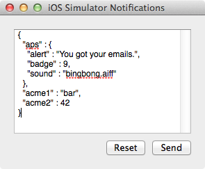
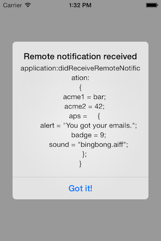

# SimulatorRemoteNotifications

SimulatorRemoteNotifications is a library to send mock remote notifications to the iOS simulator.

The library extends _UIApplication_ by embedding a mini server that listen for UDP packets containing JSON-formated payload, and a service to send notifications to the mini server.

This project includes the _iOS Simulator Notifications_ MacOSX app to help you send the mock notifications.

Note that SimulatorRemoteNotifications does not send notification through Apple's Push Service.

## Install

### Install with [CocoaPods](http://cocoapods.org)

Add a pod entry to your Podfile:

    pod 'SimulatorRemoteNotifications', '~> 0.0.3'

Install the pod(s) by running:

    pod install

### Install the static library

1. Copy the project file in your project
2. Link your binary with the library, under _Target_ > _Build Phases_ > _Link binary with libraries_ then add the _libSimulatorRemoteNotifications.a_
3. set `OTHER_LINKER_FLAGS="-ObjC"` for your target

    
### Install manually

1. clone this repository
2. add the files in the _SimulatorRemoteNotifications_ directory to your project
3. set `OTHER_LINKER_FLAGS="-ObjC"` for your target

## Usage

### Listening for mock remote notifications

First add `#import "UIApplication+SimulatorRemoteNotifications.h"` to your application delegate.

Then implement either _application:didReceiveRemoteNotification:_ or _application:didReceiveRemoteNotification:fetchCompletionHandler:_ (background notification, iOS7).

Finally call start listening for mock remote notifications:

	- (BOOL)application:(UIApplication *)application didFinishLaunchingWithOptions:(NSDictionary *)launchOptions {
	
    	...

		#if DEBUG
			[application listenForRemoteNotifications];
		#endif
	
    	return YES;
	}

When _listenForRemoteNotifications_ is called, _application:didRegisterForRemoteNotificationsWithDeviceToken:_ receives a token in the following format instead of random characters: `simulator-remote-notification=IP:PORT`

The default port number is 9930. If you want to change the port, use _setRemoteNotificationsPort_ before calling _listenForRemoteNotifications_:

	application.remoteNotificationsPort = 1234;

Now, to send a remote notification, send an udp packet to localhost:9930.

Note that if you send a notification while the app is in the background, _application:didReceiveRemoteNotification:fetchCompletionHandler:_ will only be called when you bring the app to the foreground.

### Sending a mock remote notification with the _iOS Simulator Notifications_  app

The project comes with a OSX app called _iOS Simulator Notifications_ to help you send notifications to the iOS Simulator.

Build and run the target and you'll have a nice interface to send notification to your app in the simulator (see screenshots).

### Sending a mock remote notification in tests

First add `#import "ACSimulatorRemoteNotificationsService.h"` to your test

Send you notification with 

	[[ACSimulatorRemoteNotificationsService sharedService] send:@{@"message":@"message"}];
	
You can change the host (default: 127.0.0.1) and port (default: 9930) with 

	[[ACSimulatorRemoteNotificationsService sharedService] setRemoteNotificationsPort:1234];
	[[ACSimulatorRemoteNotificationsService sharedService] setRemoteNotificationsHost:@"10.0.0.1"];

### Sending a mock remote notification from the command line

You can also send mock remote notifications from the terminal by using netcat:

	echo -n '{"message":"message"}' | nc -4u -w1 localhost 9930

## Screenshot

## Examples

You can look at _SimulatorRemoteNotifications.xcodeproj_ for examples:

- in _SimulatorRemoteNotificationsExample_, the _application:didReceiveRemoteNotification:_ method is called
- in _SimulatorRemoteNotificationsBackgroundExample_, the _application:didReceiveRemoteNotification:fetchCompletionHandler:_ method is called

## Documentation

If you have [appledoc](http://gentlebytes.com/appledoc/) installed, you can generate the documentation by running the corresponding target.
	
## Note

(Real) Apple remote notifications are limited to 256 bytes content length.
